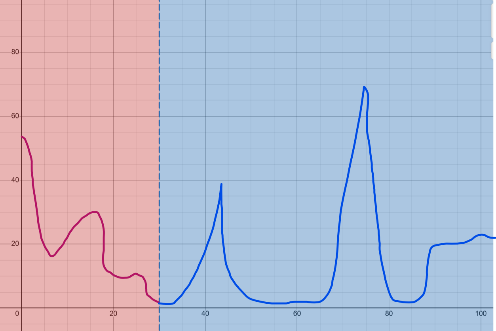
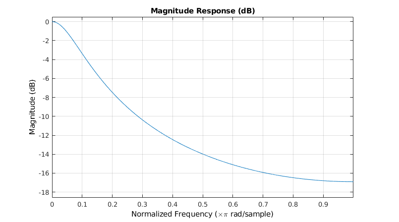
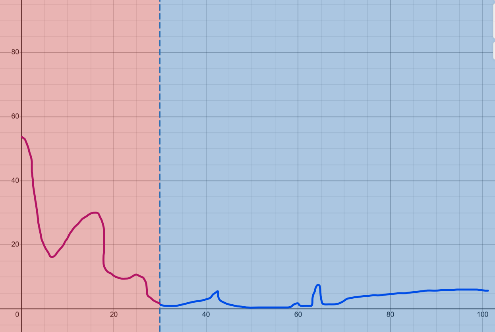
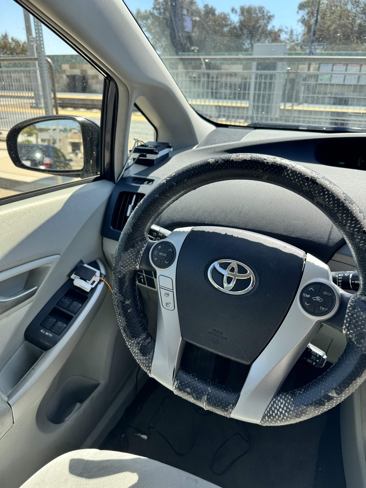

# BLE Proximity Detection
## Alexander Wang 
## ECE 196 SP26
---

### Abstract

This tutorial will walk you through implementing **rough distance measurement using bluetooth RSSI strength signals**. It will also give a brief overview of how to use the ESP32's BLE features, how to lock on to a specific bluetooth signal, and how to filter the RSSI strength number for a more reliable signal. Finally, the tutorial will also go into additional supporting logic for our car autolocking project as an example of a possible use case. 

### Objectives
* [Introduction](#introduction)
    * [Limitations](#limitations)
    * [Theory](#theory---ece-101-basic-signal-filtering)
* [Supplies](#supplies)
* [Hardware](#hardware)
* [Software](#software)
    * [Requirements](#requirements)
    * [Scanning for a Specific Hardware Address](#scanning-for-a-specific-hardware-address)
    * [Storing and Filtering RSSI Readings](#storing-and-filtering-rssi-readings)
    * [Car Autolock: RSSI Based Logic](#car-autolock-rssi-based-logic)
* [Resources](#resources)

---

### Introduction 

One problem that you may encounter while designing your device for a given problem is figuring out the distance between two different devices. If both of these devices support bluetooth, then the Bluetooth Low Energy (BLE) Received Signal Strength Indicator (RSSI) might be a straightforward solution to your problem. 

#### Limitations
Although BLE RSSI is a noisy signal, interfered with by many common materials, including people, which can cause readings to have wild variance, some signal smoothing techniques can mitigate these issues and provide a decent form of near vs. far detection.

#### Theory - ECE 101 (Basic Signal Filtering)

Assuming that the distance between the two bluetooth devices will not be changing very quickly, we know that a ground truth of distance should be a relatively slowly changing quantity, and thus the BLE RSSI should also reflect that quality.

Meanwhile, interference factors for the BLE RSSI signal will likely introduce a form of noise that may only briefly affect the signal, say for 1 or 2 readings. The readings themselves will also have a consistent fluctuation.

In the context of signal processing, this means that the quantity we care about is low frequency, while the signal that distorts our measurements is high frequency. Lets say the quantity we care about is a discrete function $x[n]$, while the noise is captured by another discrete function $c[n]$. 

Then, we can say that our measured signal $y[n]$ is the sum of both functions:

$$y[n]=x[n] + c[n]$$

Since we assumed that our distance between both devices is low frequency, we can assume that the majority of the signal power exists in a lower frequency band, and the noise exists in a higher frequency band:



This arbitrary example of an amplitude spectrum of the recorded signal $y$ has a red portion, and a blue portion. The red portion is the data that likely has useful information about the distance, the quantity we care about. Meanwhile, the higher frequency signals, are likely noise. In order to isolate these combined signals, we construct a filter. 

Additionally, since our data is discrete (i.e. we are making repeated individual measurements), we need a discrete filter.

One such example of this is an exponential moving average filter. The filter is described below:
$$y[n] = \alpha x[n] + (1-\alpha)y[n-1]$$
Where $y$ is the filter output, $x$ is the filter input, and $\alpha$ is an arbitrary parameter between 0 and 1. Note that as alpha increases, the filter becomes more and more sensitive to high frequencies. 

The following graphic was obtained from [here](https://tttapa.github.io/Pages/Mathematics/Systems-and-Control-Theory/Digital-filters/Exponential%20Moving%20Average/Exponential-Moving-Average.html). It was created by Pieter P.



Note that as x increases in the plot, the magnitude decreases, which means that high frequency signals are attenuated, while low frequency signals are left as is. This is ideal to help isolate the slowly changing distance between two bluetooth devices.

After applying the filter to our original arbitrary amplitude spectrum we get the following spectrum: (Note that this is not to scale, and is just to illustrate the effect of the filter)



Now the majority of signal strength is in the zone that we care about.

---

### Supplies

For this tutorial, you will need an ESP32 Devboard, and a bluetooth device capable of advertising itself to other devices for discovery.

---

### Hardware

Hardware Setup is relatively simple. Just make sure your ESP32 devboard works as expected, and can load code from the Arduino IDE. 

For your bluetooth device, make sure you know the MAC address of your device. In this tutorial we will be using a bluetooth beacon, which has its MAC address printed on a label on the beacon itself. Other beacons may have special apps designed to find the specific beacon, and can display the MAC address.

---

### Software

#### Requirements

In a new arduino sketch, add the following imports at the top:
```c++
#include <BLEDevice.h>
#include <BLEScan.h>
#include <BLEAdvertisedDevice.h>
```
These are required header files which implement critical classes and methods for the ESP32 Bluetooth features.

#### Scanning for a Specific Hardware Address

Lets begin by scanning for our specific bluetooth beacon. 

After the imports add the following line:
```c++
BLEScan* pBLEScan;
```

In setup(), add the following code.
```c++
void setup() {
  Serial.begin(115200);
  Serial.printf("Scanning for device: %s\n\n", targetMAC);

  BLEDevice::init("");
  pBLEScan = BLEDevice::getScan();
  pBLEScan->setActiveScan(true);
  pBLEScan->setDuplicateFilter(true);
  pBLEScan->setInterval(100);
  pBLEScan->setWindow(99);
}
```

In loop(), add the following code.
```c++
void loop() {
    BLEScanResults* results = pBLEScan->start(1, false);

    for (int i = 0; i < results->getCount(); i++) {
        BLEAdvertisedDevice advertisedDevice = results->getDevice(i);
        Serial.printf("MAC Address: %s | Name: %s | RSSI: %d dBm\n",
            advertisedDevice.getAddress().toString().c_str(),
            advertisedDevice.haveName() ? advertisedDevice.getName().c_str() : "(unknown)",
            advertisedDevice.getRSSI()
        );
    }
}
```

The following code will scan every second for nearby bluetooth devices, and print each one's MAC Address, name, and RSSI. Depending on how many bluetooth devices are nearby, you may see many listings. At the very least, you should be able to see your bluetooth beacon if its on and nearby. 

Next, at the top of your code, add:
```c++
const char* targetMAC = "aa:bb:cc:dd:ee:ff"; // your device MAC address here.
```

And edit loop():
```c++
void loop() {
    BLEScanResults* results = pBLEScan->start(1, false);

    for (int i = 0; i < results->getCount(); i++) {
        BLEAdvertisedDevice advertisedDevice = results->getDevice(i);
        if (String(advertisedDevice.getAddress().toString().c_str()).equalsIgnoreCase(targetMAC)) {
            Serial.printf("MAC Address: %s | Name: %s | RSSI: %d dBm\n",
                advertisedDevice.getAddress().toString().c_str(),
                advertisedDevice.haveName() ? advertisedDevice.getName().c_str() : "(unknown)",
                advertisedDevice.getRSSI()
            );
        }
    }
}
```

Now you should only see your beacon appearing in the serial monitor. Don't worry if there are sometimes no devices found.

#### Storing and Filtering RSSI Readings

Next, let's store the RSSI data and use some filters to create an aggregate signal from the input data. At the top of your code, add the following:
```c++
const int HISTORY_SIZE = 3;
int rssiHistory[HISTORY_SIZE];
int scanIndex = 0;
```

In setup():
```c++

void setup() {
  Serial.begin(115200);
  Serial.printf("Scanning for device: %s\n\n", targetMAC);

  // NEW CODE
  for (int i = 0; i < HISTORY_SIZE; i++) {
    rssiHistory[i] = 0;
  }
  // END OF NEW CODE

  BLEDevice::init("");  
  pBLEScan = BLEDevice::getScan();
  pBLEScan->setActiveScan(true);
  pBLEScan->setDuplicateFilter(true);
  pBLEScan->setInterval(100);
  pBLEScan->setWindow(99);
}
```

And a new loop():
```c++
void loop() {
  BLEScanResults* results = pBLEScan->start(1, false);

  bool found = false;
  for (int i = 0; i < results->getCount(); i++) {
    BLEAdvertisedDevice d = results->getDevice(i);
    if (String(d.getAddress().toString().c_str()).equalsIgnoreCase(targetMAC)) {
      rssiHistory[scanIndex % HISTORY_SIZE] = d.getRSSI();
      scanIndex++;
      found = true;
      break;
    }
  }

  // print the last 3 readings in order of their readings
  Serial.print("Last 3 RSSI: ");
  for (int i = 0; i < HISTORY_SIZE; i++) {
    int idx = (scanIndex - HISTORY_SIZE + i) % HISTORY_SIZE;
    Serial.printf("%d  ", rssiHistory[idx]);
  }
  Serial.println();

  pBLEScan->clearResults();
  delay(1000);
}
```

Now the code will repeatedly record the RSSI strength of the bluetooth beacon if its found nearby, and it wont make any readings if the beacon isn't found.

To run a simple filter on this data, we can just take the average of all numbers in the array, to implement a moving mean. Add the following code below the print messages:

```c++
void loop() {
    // ...

    Serial.println();

    int sum = 0;
    for (int i = 0; i < HISTORY_SIZE; i++) {
        sum += rssiHistory[i];
    }

    int avg = sum / HISTORY_SIZE;
    Serial.printf("Average RSSI: %d\n", avg);

    pBLEScan->clearResults();
    delay(1000);
}
```
Now we have a moving mean which can reduce the effect of noise on our RSSI readings. Now with some measurements, you can set an approximate threshold that indicates when you consider the device to be far, vs close.

#### Car Autolock: RSSI Based Logic

For our project found [here](https://sites.google.com/ucsd.edu/ece-196-project-site-awjypm/home), we needed some extra logic to account for when the bluetooth beacon is out of range entirely from our scanning device. Since the user may move far beyond scanning distance for the BLE device, we needed to account for deciding when enough failed readings occurred to consider the user out of range.



To do this, we implemented a counter for consecutive failed readings. If the number of consecutive failed readings exceeded a specific threshold, then the user would be considered out of range and the door would be locked by the servo actuator.

### Resources

The following paper is a good follow up for looking into more advanced filtering algorithms for RSSI range inference:
[An RSSI Classification and Tracing Algorithm to Improve Trilateration-Based Positioning](https://pmc.ncbi.nlm.nih.gov/articles/PMC7436166/)
